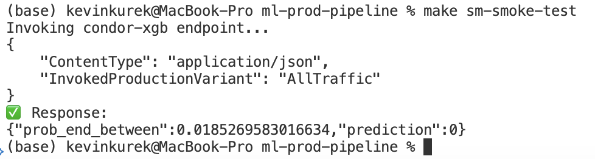

# ML Production Pipeline

This is a **code-only** deployment of a production end-to-end machine learning pipeline inclusive of MLOps on AWS using:
- **Terraform (infra coordination)** - VPC, ECR, ECS, Fargate, S3, IAM, CloudWatch
- **Github Actions (CI/CD)** - Auto-deployment of images to ECR on successful main branch commit
- **Docker + ECS (Fargate first, EC2-ready)**
- **SageMaker** for training/hosting
- **Docker Airflow & MWAA (AWS Managed Airflow)** for orchestration

## Airflow XGBoost SageMaker Training & API Endpoint Deployment


## ECS feature builds & SageMaker auto-promotion capabilites via SageMaker Model Registry


## Github Actions auto docker image build & push to ECR on successful main branch commit


## Smoke-test of resulting API Endpoint



## Quick Start
The Makefile has automated a ton of the build steps.
```bash
# 1. Start in project root, creates virtual env (.venv) & installs requirements
$ cd ml-prod-pipeline
$ make setup
>>
  (.venv folder now in root directory)

# 2. set a .env folder at root folder level
$ cd ml-prod-pipeline
$ touch .env
$ nano .env
>>
  # fill in
  # AWS_ACCESS_KEY=xxxxxx
  # AWS_SECRET_ACCESS_KEY=xxxxxx
  # AWS_PROFILE=kevin_xxxx (this is a temp IAM User with admin privileges in AWS)
  # AWS_REGION=us-west-x
  # PREFIX=condor
  # GITHUB_TOKEN=ghp_xxxxxxx

# quick spot-check creds were set correctly
$ make env-check
>>
  # displays cred output

# 3. Set up terraform resources - VPC, ECR, ECS, etc.
$ make boostrap
>> initializes terraform

$ make plan
>> shows terraform plan

$ make apply
>> applies terraform plan and deploys AWS resources

# 4. Build Docker images & push to ECR
$ make build-push
>> will see images inside AWS ECR

# 5. Create and send data to S3 buckets created by terraform
# NOTE: this step generates synthetic data to the bucket if there isn't any present so the example can run.
$ make prep-data
>>
  Uploaded 10,000 rows to s3://condor-data-xxxx/features/condor_train_20xxxxx.csv

# 6. Create a sagemaker training job from that uploaded data
$ make sm-train
>>
   🚀 Starting SageMaker training job: condor-xgb-xxx
   {
      "TrainingJobArn": "arn:aws:sagemaker:us-west-2:xxx:training-job/condor-xgb-xxx"
   }
   ⏳ Waiting for training job condor-xgb-xxx to complete...
   ✅ Training completed successfully!

# 7. Create an endpoint from that trained model - registers model, endpoint config, & deploys endpoint
$ make sm-create-endpoint
>>
   Waiting for endpoint to become InService (≈10min first time)...
   ✅ Endpoint ready.
   -------------------------------------------------------------------------------
   |                              DescribeEndpoint                               |
   +----------------------------------------------------------------+------------+
   |                               Arn                              |  Status    |
   +----------------------------------------------------------------+------------+
   |  arn:aws:sagemaker:us-west-2:xxx:endpoint/condor-xgb           |  InService |
   +----------------------------------------------------------------+------------+

# 8. Send a smoke test to the API
$ make sm-smoke-test
>>
   Invoking condor-xgb endpoint...
   {
      "ContentType": "application/json",
      "InvokedProductionVariant": "AllTraffic"
   }
   ✅ Response:
   {"prob_end_between":0.0185269583016634,"prediction":0}

# 9. View logs for API request sent
$ make sm-logs
>>
   ----------------------------------------------------------------------------------------------
   |                                        GetLogEvents                                        |
   +---------------------------------------------------------------------------+----------------+
   |                                  Message                                  |     Time       |
   +---------------------------------------------------------------------------+----------------+
   |  INFO:     Started server process [15]                                    |  1761329136964 |
   |  INFO:     Waiting for application startup.                               |  1761329136965 |
   |  INFO:     Application startup complete.                                  |  1761329136965 |
   |  INFO:     Uvicorn running on http://0.0.0.0:8080 (Press CTRL+C to quit)  |  1761329136965 |
   |  INFO:     127.0.0.1:38402 - "GET /ping HTTP/1.1" 200 OK                  |  1761329138587 |
   |  INFO:     127.0.0.1:38412 - "POST /invocations HTTP/1.1" 200 OK          |  1761329139244 |
   +---------------------------------------------------------------------------+----------------+

```

## Tear Down Everything
```bash
# Tear down everyting. 
# make down = sm-teardown empty-buckets nuke-ecr destroy
# sm-teardown - tear down all sagemaker services
# empty-buckets - clear all s3 buckets
# nuke-ecr - clear all images inside ecr
# destory - tear down all terraform resources - VPC, Subnets, NAT Gateway, IGW, ECR, S3, etc..
$ make down
>>
  Deleting SageMaker endpoint: condor-xgb
  ...
  Destroy complete! Resources: 42 destroyed.
```

## Run a Local Airflow Render, Test, Debug, & Trigger
```bash
# Make sure steps 1-4 from Quick Start are done first!

## Setup Airflow Docker Env
$ cd airflow
$ docker compose up -d
$ docker compose exec airflow-apiserver env | grep -E 'AWS_|PREFIX|GITHUB_TOKEN'
>> 
  confirms root credentials were set in Airflow

# confirm some data is in the bucket
$ make prep-data

# clear out any fake or temp vars that might be hanging in airflow
$ make af-vars-clear

# set airflow variables from terraform generated values 
$ make af-vars-from-tf-min

# show what was set
$ make af-vars-show

# show a local render of 1 task (train) inside the condor_ml_pipeline DAG
$ make af-render DAG=condor_ml_pipeline TASK=train DS=2025-10-26

# do a local docker test of 1 task (train) inside the condor_ml_pipeline DAG
$ make af-test DAG=condor_ml_pipeline TASK=train DS=2025-10-26

# do a debug session inside AF (can see in UI)
$ make af-shell
python dags/condor_pipeline.py
>>
  DagRun Finished - SageMaker Endpoint Deployed

# trigger the actual DAG (which you can see in the UI)
$ make af-trigger DAG=condor_ml_pipeline

# send a smoke-test to the deployed endpoint
$ make sm-smoke-test
```

## Repo Layout
```
├── Makefile
├── README.md
├── airflow
│   ├── dags
│   │   ├── condor_pipeline.py
│   │   └── test.py
│   ├── docker-compose.yml
│   └── requirements.txt
├── images
├── infra
│   └── terraform
│       ├── envs
│       ├── github_oidc.tf
│       ├── main.tf
│       ├── modules
│       │   ├── ecr
│       │   ├── ecs
│       │   ├── iam
│       │   ├── s3
│       │   └── vpc
│       ├── outputs.tf
│       ├── providers.tf
│       └── variables.tf
├── requirements.txt
├── sagemaker
│   ├── model_registry.py
│   └── pipeline.py
├── services
│   ├── batch
│   │   ├── Dockerfile
│   │   └── score_batch.py
│   ├── features
│   │   ├── Dockerfile
│   │   └── build_features.py
│   ├── inference
│   │   ├── Dockerfile
│   │   ├── app.py
│   │   ├── requirements.txt
│   │   └── serve
│   └── training
│       ├── Dockerfile
│       ├── requirements.txt
│       └── train.py
└── tools
    └── prepare_data.py
```


## Terraform commands
```bash
cd infra/terraform
terraform init

# re-format then init
terraform fmt -recursive
terraform init

# view terraform plan
terraform plan -var="prefix=condor" -var="region=us-west-2"

# apply terraform plan
terraform apply -auto-approve -var="prefix=condor" -var="region=us-west-2"


#### if you want to start from scratch

# nuke all images and repos inside ECR
for REPO in $(aws ecr describe-repositories --region "$AWS_REGION" --query 'repositories[].repositoryName' --output text); do
  echo "Deleting repo $REPO (force)..."
  aws ecr delete-repository --repository-name "$REPO" --region "$AWS_REGION" --force
done

# view destory terraform plan
terraform plan -destroy -var="prefix=condor" -var="region=us-west-2"

# actually destroy terraform resources
terraform destroy -auto-approve -var="prefix=condor" -var="region=us-west-2"


#### confirm all terraform related resources are destroyed

# VPCs (should show only default 172.31.0.0/16)
aws ec2 describe-vpcs --region "$AWS_REGION" \
  --query 'Vpcs[].CidrBlock' --output text || echo "No VPCs found"

# S3 buckets (any condor-related buckets)
[ -z "$(aws s3 ls | grep condor)" ] && echo "No condor buckets" || aws s3 ls | grep condor

# ECR repositories
[ -z "$(aws ecr describe-repositories --region "$AWS_REGION" --query 'repositories[].repositoryName' --output text)" ] \
  && echo "No ECR repos" \
  || aws ecr describe-repositories --region "$AWS_REGION" --query 'repositories[].repositoryName' --output text

# IAM roles (any containing 'condor')
[ -z "$(aws iam list-roles --query 'Roles[?contains(RoleName, `condor`)].RoleName' --output text)" ] \
  && echo "No condor IAM roles" \
  || aws iam list-roles --query 'Roles[?contains(RoleName, `condor`)].RoleName' --output text

# Optional: SageMaker endpoints (confirm no active ones remain)
[ -z "$(aws sagemaker list-endpoints --region "$AWS_REGION" --query 'Endpoints[?contains(EndpointName, `condor`)].EndpointName' --output text)" ] \
  && echo "No condor SageMaker endpoints" \
  || aws sagemaker list-endpoints --region "$AWS_REGION" --query 'Endpoints[?contains(EndpointName, `condor`)].EndpointName' --output text
```

## After terraform resources are created
```bash
unset AWS_ACCESS_KEY_ID AWS_SECRET_ACCESS_KEY AWS_SESSION_TOKEN AWS_PROFILE
export AWS_REGION=us-west-2
export AWS_SDK_LOAD_CONFIG=1
ACCOUNT_ID=$(aws sts get-caller-identity --query Account --output text)
echo $ACCOUNT_ID
>>
    1......xxx

ART_BUCKET=$(terraform output -raw artifacts_bucket)
echo $ART_BUCKET
>>
   condor-artifacts-f.....

# go back to home directory
cd ../../

# Log in to your account's ECR
aws ecr get-login-password --region $AWS_REGION \
| docker login --username AWS --password-stdin ${ACCOUNT_ID}.dkr.ecr.${AWS_REGION}.amazonaws.com
Login Succeeded
>>
Login Succeeded

# push image to ECR
make build-push ACCOUNT_ID="${ACCOUNT_ID}" AWS_REGION="${AWS_REGION}"
```

## Confirm terraform & account
```bash
ACCOUNT_ID=$(aws sts get-caller-identity --query Account --output text)
ROLE_ARN=$(aws iam get-role --role-name condor-sagemaker-exec --query Role.Arn --output text)
ART_BUCKET=$(cd infra/terraform && terraform output -raw artifacts_bucket)
DATA_BUCKET=$(cd infra/terraform && terraform output -raw data_bucket)
echo "ACCOUNT_ID=$ACCOUNT_ID
ROLE_ARN=$ROLE_ARN
ART_BUCKET=$ART_BUCKET
DATA_BUCKET=$DATA_BUCKET
AWS_REGION=$AWS_REGION"
```

## Start a SageMaker training job
```bash
# confirm data is in s3
aws s3 ls "s3://${DATA_BUCKET}/features/" --region "$AWS_REGION"

# start a training job
TRAIN_IMAGE="${ACCOUNT_ID}.dkr.ecr.${AWS_REGION}.amazonaws.com/condor-training:latest"
JOB="condor-xgb-$(date +%Y%m%d%H%M%S)"

aws sagemaker create-training-job \
  --region "$AWS_REGION" \
  --training-job-name "$JOB" \
  --role-arn "$ROLE_ARN" \
  --algorithm-specification TrainingImage="$TRAIN_IMAGE",TrainingInputMode=File \
  --input-data-config "[{\"ChannelName\":\"train\",\"DataSource\":{\"S3DataSource\":{\"S3Uri\":\"s3://${DATA_BUCKET}/features/\",\"S3DataType\":\"S3Prefix\",\"S3DataDistributionType\":\"FullyReplicated\"}}}]" \
  --output-data-config S3OutputPath="s3://${ART_BUCKET}/models/" \
  --resource-config InstanceType=ml.m5.large,InstanceCount=1,VolumeSizeInGB=10 \
  --stopping-condition MaxRuntimeInSeconds=900,MaxWaitTimeInSeconds=1800 \
  --enable-managed-spot-training \
  --checkpoint-config S3Uri="s3://${ART_BUCKET}/checkpoints/",LocalPath="/opt/ml/checkpoints"

# wait for training job return status
aws sagemaker wait training-job-completed-or-stopped --training-job-name "$JOB" --region "$AWS_REGION"
```

## Debug a SageMaker training job
```bash
# Will see this inside SageMaker AI -> Training Jobs
   condor-xgb-20xxxxxxxx 10/23/2025, 12:40:44 PM

# get the log stream if you encounter a failure
aws logs describe-log-streams \
  --log-group-name /aws/sagemaker/TrainingJobs \
  --log-stream-name-prefix "$JOB" \
  --query 'logStreams[].logStreamName' --output text \
  --region "$AWS_REGION"
>>
  condor-xgb-20251023124715/algo-1-1761248879

# get the logs out of that value
aws logs get-log-events \
  --log-group-name /aws/sagemaker/TrainingJobs \
  --log-stream-name "condor-xgb-20251023124715/algo-1-1761248879" \
  --limit 200 --query 'events[].message' --output text \
  --region "$AWS_REGION"
>>
  [FATAL tini (7)] exec python failed: Exec format error
# ^ means you built your image on apple silicon but sagemaker expected linux/amd64, needed to add --platform linux/amd64 to Makefile for images being built before pushed to ECR

# confirm they're now amd64
docker inspect condor-training:latest | grep Architecture
>>
  "Architecture": "amd64",
```

## Deploying an endpoint
```bash
# Most recent training job
JOB=$(aws sagemaker list-training-jobs \
  --region "$AWS_REGION" \
  --sort-by CreationTime --sort-order Descending \
  --max-results 1 \
  --query 'TrainingJobSummaries[0].TrainingJobName' --output text)

echo "Using training job: $JOB"

# see the model artifact in s3
MODEL_DATA=$(aws sagemaker describe-training-job \
  --region "$AWS_REGION" \
  --training-job-name "$JOB" \
  --query 'ModelArtifacts.S3ModelArtifacts' --output text)

echo "MODEL_DATA=$MODEL_DATA"

# register model in sagemaker
INF_IMAGE="${ACCOUNT_ID}.dkr.ecr.${AWS_REGION}.amazonaws.com/condor-inference:latest"

# you must supply the specific endpoint here to avoid sagemakers error
# Model entrypoint executable "serve" was not found in container PATH
aws sagemaker create-model \
  --region "$AWS_REGION" \
  --model-name "$JOB" \
  --primary-container Image="$INF_IMAGE",ModelDataUrl="$MODEL_DATA",Mode=SingleModel \
  --execution-role-arn "$ROLE_ARN"

# create serverless endpoint config - this is cheapest for POC
aws sagemaker create-endpoint-config \
  --region "$AWS_REGION" \
  --endpoint-config-name "condor-xgb-sls" \
  --production-variants "[{\"ModelName\":\"${JOB}\",\"VariantName\":\"AllTraffic\",\"ServerlessConfig\":{\"MemorySizeInMB\":2048,\"MaxConcurrency\":1}}]"

# create a new endpoint
aws sagemaker create-endpoint \
  --region "$AWS_REGION" \
  --endpoint-name "condor-xgb" \
  --endpoint-config-name "condor-xgb-sls"

aws sagemaker wait endpoint-in-service --endpoint-name "condor-xgb" --region "$AWS_REGION"
>>
  (This takes some time... about 10min for me first time)
  "EndpointArn": "arn:aws:sagemaker..../condor-xgb"


# OR update an existing endpoint if you have one already
aws sagemaker update-endpoint \
  --region "$AWS_REGION" \
  --endpoint-name "condor-xgb" \
  --endpoint-config-name "condor-xgb-sls"

aws sagemaker wait endpoint-in-service --endpoint-name "condor-xgb" --region "$AWS_REGION"

# SMOKE TEST the endpoint
aws sagemaker-runtime invoke-endpoint \
  --region "$AWS_REGION" \
  --endpoint-name "condor-xgb" \
  --content-type "application/json" \
  --accept "application/json" \
  --body fileb://payload.json \
  out.json && cat out.json
  >>
    {"prob_end_between":0.729040265083313,"prediction":1}% 
```

## Look at API endpoint logs
```bash
# see the last 10 call logs to SageMaker Endpoint
aws logs get-log-events \
  --region us-west-2 \
  --log-group-name /aws/sagemaker/Endpoints/condor-xgb \
  --log-stream-name "$(aws logs describe-log-streams \
        --log-group-name /aws/sagemaker/Endpoints/condor-xgb \
        --order-by LastEventTime \
        --descending \
        --query 'logStreams[0].logStreamName' \
        --output text)" \
  --limit 10 \
  --query 'events[].{Time:@.timestamp,Message:@.message}' \
  --output table
>>
   ----------------------------------------------------------------------------------------------
   |                                        GetLogEvents                                        |
   +---------------------------------------------------------------------------+----------------+
   |                                  Message                                  |     Time       |
   +---------------------------------------------------------------------------+----------------+
   |  INFO:     Started server process [15]                                    |  1761329136964 |
   |  INFO:     Waiting for application startup.                               |  1761329136965 |
   |  INFO:     Application startup complete.                                  |  1761329136965 |
   |  INFO:     Uvicorn running on http://0.0.0.0:8080 (Press CTRL+C to quit)  |  1761329136965 |
   |  INFO:     127.0.0.1:38402 - "GET /ping HTTP/1.1" 200 OK                  |  1761329138587 |
   |  INFO:     127.0.0.1:38412 - "POST /invocations HTTP/1.1" 200 OK          |  1761329139244 |
   +---------------------------------------------------------------------------+----------------+
```

## Cleanup an endpoint
```bash
aws sagemaker delete-endpoint --endpoint-name "condor-xgb" --region "$AWS_REGION"
aws sagemaker delete-endpoint-config --endpoint-config-name "condor-xgb-sls" --region "$AWS_REGION"
aws sagemaker delete-model --model-name "$JOB" --region "$AWS_REGION"
```

## Rough billing approximation command
```bash
aws ce get-cost-and-usage \
  --time-period Start=$(date -v1d +%Y-%m-01),End=$(date -v+1m -v1d +%Y-%m-01) \
  --granularity MONTHLY \
  --metrics "BlendedCost" \
  --region us-east-1 \
  --query 'ResultsByTime[0].Total.BlendedCost.Amount' \
  --output text
>>
  2.2969
```

## Makefile Helpers
```bash
make af-list                # list all airflow dags
make af-errors              # check if any dag upload errors
make af-shell               # get inside airflow API shell; 
   $ python dags/test.py    # run test.py DAG in debug mode
make af-render DAG=condor_ml_pipeline TASK=train DS=2025-10-26    # dry-run jinja templating & config for a task
make af-test DAG=condor_ml_pipeline TASK=train DS=2025-10-26      # execute task locally but in isolation, confirms aws permissions
```

## Create fake AWS vars to confirm jinja templating while AWS resources are down
```bash
# 1. create fake aws env variables to confirm jinja injection is working
make af-vars

# 2. render to confirm a dry-run jinja is correct
make af-render DAG=condor_ml_pipeline TASK=train DS=2025-10-26
>>
  {'TrainingJobName': 'condor-xgb-xxxxxxxx', 
  'RoleArn': 'arn:aws:iam::123:role/dummy', 
  'AlgorithmSpecification': {
  'TrainingImage': '111.dkr.ecr.us-west-2.amazonaws.com/condor-training:latest', 
  'TrainingInputMode': 'File'}, 
  'InputDataConfig': [{'ChannelName': 'train', 'DataSource': {'S3DataSource': {'S3Uri': 's3://condor-data-x/features/', 'S3DataType': 'S3Prefix', 'S3DataDistributionType': 'FullyReplicated'}}}], 
  'OutputDataConfig': {'S3OutputPath': 's3://condor-artifacts-x/models/'}, 
  'ResourceConfig': {'InstanceType': 'ml.t3.medium', 'InstanceCount': 1, 'VolumeSizeInGB': 10}, 'StoppingCondition': {'MaxRuntimeInSeconds': 900}}
```

## Confirm airflow-apiserver sees local dags
```bash

# confirm your local DAGs are there 
docker compose exec airflow-apiserver ls -la /opt/airflow/dags
>>
  test.py
  condor_pipeline.py

# confirm no upload errors in the DAG
docker compose exec airflow-apiserver airflow dags list-import-errors
>>
  "No data found" means it worked.

# list all DAGs (examples will be there too)
docker compose exec airflow-apiserver airflow dags list | grep -i condor
```

## MWAA Execution Policy
Manually updated policy during MWAA creation for IAM role AmazonMWAA-condor-mwaa-J inside policy MWAA-Execution-Policy-5c07xxxxxx.
```bash
# Policy MWAA-Execution-Policy-5c07xxxxxx
{
  "Version": "2012-10-17",
  "Statement": [
    {
      "Effect": "Allow",
      "Action": "airflow:PublishMetrics",
      "Resource": "arn:aws:airflow:us-west-2:<ACCOUNT_ID>:environment/condor-mwaa"
    },
    {
      "Effect": "Allow",
      "Action": [
        "logs:CreateLogStream","logs:CreateLogGroup","logs:PutLogEvents",
        "logs:GetLogEvents","logs:GetLogRecord","logs:GetLogGroupFields",
        "logs:GetQueryResults","logs:DescribeLogGroups"
      ],
      "Resource": [
        "arn:aws:logs:us-west-2:<ACCOUNT_ID>:log-group:airflow-condor-mwaa-*",
        "arn:aws:logs:us-west-2:<ACCOUNT_ID>:log-group:*"
      ]
    },
    {
      "Effect": "Allow",
      "Action": "cloudwatch:PutMetricData",
      "Resource": "*"
    },
    {
      "Effect": "Allow",
      "Action": [
        "sqs:ChangeMessageVisibility","sqs:DeleteMessage","sqs:GetQueueAttributes",
        "sqs:GetQueueUrl","sqs:ReceiveMessage","sqs:SendMessage"
      ],
      "Resource": "arn:aws:sqs:us-west-2:*:airflow-celery-*"
    },

    {
      "Sid": "ListDagBucket",
      "Effect": "Allow",
      "Action": ["s3:ListBucket","s3:GetBucketLocation","s3:GetBucketVersioning"],
      "Resource": "arn:aws:s3:::condor-mwaa-bucket",
      "Condition": { "StringLike": { "s3:prefix": ["dags/*","plugins/*","requirements.txt"] } }
    },
    {
      "Sid": "ReadDagObjects",
      "Effect": "Allow",
      "Action": ["s3:GetObject","s3:GetObjectVersion"],
      "Resource": [
        "arn:aws:s3:::condor-mwaa-bucket/dags/*",
        "arn:aws:s3:::condor-mwaa-bucket/plugins/*",
        "arn:aws:s3:::condor-mwaa-bucket/requirements.txt"
      ]
    },

    {
      "Sid": "ListDataArtifactBuckets",
      "Effect": "Allow",
      "Action": ["s3:ListBucket","s3:GetBucketLocation"],
      "Resource": [
        "arn:aws:s3:::condor-data-bucket",
        "arn:aws:s3:::condor-artifacts-bucket"
      ]
    },
    {
      "Sid": "RWDataArtifactObjects",
      "Effect": "Allow",
      "Action": ["s3:GetObject","s3:GetObjectVersion","s3:PutObject"],
      "Resource": [
        "arn:aws:s3:::condor-data-bucket/*",
        "arn:aws:s3:::condor-artifacts-bucket/*"
      ]
    },

    {
      "Sid": "SageMakerPipeline",
      "Effect": "Allow",
      "Action": [
        "sagemaker:CreateTrainingJob","sagemaker:DescribeTrainingJob",
        "sagemaker:CreateModel","sagemaker:DescribeModel",
        "sagemaker:CreateModelPackageGroup","sagemaker:CreateModelPackage",
        "sagemaker:ListModelPackages",
        "sagemaker:CreateEndpointConfig","sagemaker:CreateEndpoint",
        "sagemaker:UpdateEndpoint","sagemaker:DescribeEndpoint"
      ],
      "Resource": "*"
    },

    {
      "Sid": "EcsRunTask",
      "Effect": "Allow",
      "Action": [
        "ecs:RunTask","ecs:DescribeTasks","ecs:StopTask",
        "ecs:DescribeClusters","ecs:DescribeTaskDefinition"
      ],
      "Resource": "*"
    },

    {
      "Sid": "AllowPassRoles",
      "Effect": "Allow",
      "Action": "iam:PassRole",
      "Resource": [
        "arn:aws:iam::<ACCOUNT_ID>:role/condor-sagemaker-exec-role",
        "arn:aws:iam::<ACCOUNT_ID>:role/condor-ecs-task-role",
        "arn:aws:iam::<ACCOUNT_ID>:role/condor-ecs-task-exec-role"
      ],
      "Condition": {
        "StringEquals": {
          "iam:PassedToService": [
            "sagemaker.amazonaws.com",
            "ecs-tasks.amazonaws.com"
          ]
        }
      }
    }
  ]
}
```


## Working Trust Relationship
```bash
{
    "Version": "2012-10-17",
    "Statement": [
        {
            "Effect": "Allow",
            "Principal": {
                "Service": [
                    "airflow.amazonaws.com",
                    "airflow-env.amazonaws.com"
                ]
            },
            "Action": "sts:AssumeRole"
        }
    ]
}
```

## Working Policy
```bash
{
    "Version": "2012-10-17",
    "Statement": [
        {
            "Effect": "Allow",
            "Action": "airflow:PublishMetrics",
            "Resource": "arn:aws:airflow:us-west-2:<ACCOUNT_ID>:environment/condor-mwaa"
        },
        {
            "Sid": "AllowAccountPABCheck",
            "Effect": "Allow",
            "Action": "s3:GetAccountPublicAccessBlock",
            "Resource": "*"
        },
        {
            "Sid": "AllowBucketPABCheck",
            "Effect": "Allow",
            "Action": "s3:GetBucketPublicAccessBlock",
            "Resource": [
                "arn:aws:s3:::condor-mwaa-bucket",
                "arn:aws:s3:::condor-data-bucket",
                "arn:aws:s3:::condor-artifacts-bucket"
            ]
        },
        {
            "Effect": "Allow",
            "Action": [
                "logs:CreateLogStream",
                "logs:CreateLogGroup",
                "logs:PutLogEvents",
                "logs:GetLogEvents",
                "logs:GetLogRecord",
                "logs:GetLogGroupFields",
                "logs:GetQueryResults",
                "logs:DescribeLogGroups"
            ],
            "Resource": [
                "arn:aws:logs:us-west-2:<ACCOUNT_ID>:log-group:airflow-condor-mwaa-*",
                "arn:aws:logs:us-west-2:<ACCOUNT_ID>:log-group:*"
            ]
        },
        {
            "Effect": "Allow",
            "Action": "cloudwatch:PutMetricData",
            "Resource": "*"
        },
        {
            "Effect": "Allow",
            "Action": [
                "sqs:ChangeMessageVisibility",
                "sqs:DeleteMessage",
                "sqs:GetQueueAttributes",
                "sqs:GetQueueUrl",
                "sqs:ReceiveMessage",
                "sqs:SendMessage"
            ],
            "Resource": "arn:aws:sqs:us-west-2:*:airflow-celery-*"
        },
        {
            "Sid": "ListDagBucket",
            "Effect": "Allow",
            "Action": [
                "s3:ListBucket",
                "s3:GetBucketLocation",
                "s3:GetBucketVersioning"
            ],
            "Resource": "arn:aws:s3:::condor-mwaa-bucket",
            "Condition": {
                "StringLike": {
                    "s3:prefix": [
                        "dags/*",
                        "plugins/*",
                        "requirements.txt"
                    ]
                }
            }
        },
        {
            "Sid": "ReadDagObjects",
            "Effect": "Allow",
            "Action": [
                "s3:GetObject",
                "s3:GetObjectVersion"
            ],
            "Resource": [
                "arn:aws:s3:::condor-mwaa-bucket/dags/*",
                "arn:aws:s3:::condor-mwaa-bucket/plugins/*",
                "arn:aws:s3:::condor-mwaa-bucket/requirements.txt"
            ]
        },
        {
            "Sid": "ListDataArtifactBuckets",
            "Effect": "Allow",
            "Action": [
                "s3:ListBucket",
                "s3:GetBucketLocation"
            ],
            "Resource": [
                "arn:aws:s3:::condor-data-bucket",
                "arn:aws:s3:::condor-artifacts-bucket"
            ]
        },
        {
            "Sid": "RWDataArtifactObjects",
            "Effect": "Allow",
            "Action": [
                "s3:GetObject",
                "s3:GetObjectVersion",
                "s3:PutObject"
            ],
            "Resource": [
                "arn:aws:s3:::condor-data-bucket/*",
                "arn:aws:s3:::condor-artifacts-bucket/*"
            ]
        },
        {
            "Sid": "SageMakerPipeline",
            "Effect": "Allow",
            "Action": [
                "sagemaker:CreateTrainingJob",
                "sagemaker:DescribeTrainingJob",
                "sagemaker:CreateModel",
                "sagemaker:DescribeModel",
                "sagemaker:CreateModelPackageGroup",
                "sagemaker:CreateModelPackage",
                "sagemaker:ListModelPackages",
                "sagemaker:CreateEndpointConfig",
                "sagemaker:CreateEndpoint",
                "sagemaker:UpdateEndpoint",
                "sagemaker:DescribeEndpoint"
            ],
            "Resource": "*"
        },
        {
            "Sid": "EcsRunTask",
            "Effect": "Allow",
            "Action": [
                "ecs:RunTask",
                "ecs:DescribeTasks",
                "ecs:StopTask",
                "ecs:DescribeClusters",
                "ecs:DescribeTaskDefinition"
            ],
            "Resource": "*"
        },
        {
            "Sid": "AllowPassRoles",
            "Effect": "Allow",
            "Action": "iam:PassRole",
            "Resource": [
                "arn:aws:iam::<ACCOUNT_ID>:role/condor-sagemaker-exec-role",
                "arn:aws:iam::<ACCOUNT_ID>:role/condor-ecs-task-role",
                "arn:aws:iam::<ACCOUNT_ID>:role/condor-ecs-task-exec-role"
            ],
            "Condition": {
                "StringEquals": {
                    "iam:PassedToService": [
                        "sagemaker.amazonaws.com",
                        "ecs-tasks.amazonaws.com"
                    ]
                }
            }
        }
    ]
}
```